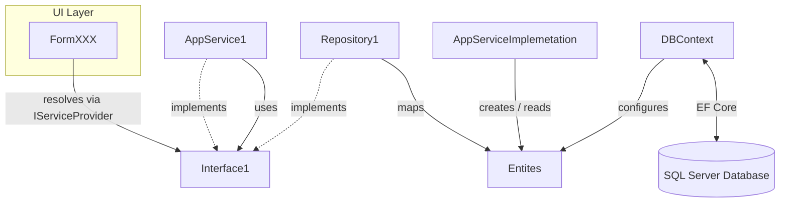

# PawsTrack

PawsTrack is a desktop application for managing a dog-walking business. It covers the full operational lifecycle: client and dog intake, walk scheduling, billing, and user management.

---

## Table of Contents

- [Project Overview](#project-overview)
- [How to Run](#how-to-run)
- [Architectural Approach](#architectural-approach)
- [Design Decisions](#design-decisions)

---

## Project Overview

PawsTrack gives dog-walking businesses a single tool to:

- Register clients and their dogs.
- Schedule and track walk sessions (Scheduled → In-Progress → Completed).
- Generate and search bills tied to completed walks.
- Manage dog walkers (create accounts, reset passwords).
- Authenticate users with role-based dashboards, there are two roles: Admin and Dog Walker, and any role has its own functionality.

The application is built with .NET 8 WinForms and stores data in a SQL Server database. In addittion the application allows initial configuration at first startup and applies all pending database migrations automatically on startup, so there is no manual database setup step.

---

## How to Run

### Prerequisites

| Requirement | Version |
|-------------|---------|
| SQL Server | 2019 or later (SQL Express is enough) |
| `dotnet-ef` global tool | 9.0.13 |

if you don't have the dotnet-ef global tool, you can install or update it from your terminal with this command:

```powershell
dotnet tool update --global dotnet-ef --version 9.0.13
```
NOTE: .NET is embebbed in the installer.

### Stup and Database Configuration

Download the installer [here](https://drive.google.com/file/d/18X2HzHLGSEm-syNUTZ2Cd8tUMWWxtYX8/view?usp=drive_link)

Follow the instructions in the [guide document](./PawsTrack_App_Install_and_User_Guide.pdf)

The connection to database will be set at the first startup of the application, but, for some manual change, the connection string is read from `PawsTrack.Presentation/appsettings.json`:

```json
{
  "ConnectionStrings": {
    "PawsTrack": "Server=(localdb)\\mssqllocaldb;Database=PawsTrack;Trusted_Connection=True;"
  }
}
```

---

## Initial Design Approach

the initial design made for this application can be found [here](./PawsTrack_DesignDocument.md)

---

## Architecture Components


---

### Layered Structure

The solution is organized into four projects following Clean Architecture principles:

```
PawsTrack.Domain          — Entities, enums, domain exceptions.
PawsTrack.Application     — Use-case interfaces and service implementations. Defines contracts in the interfaces and Data Transfer Objects.
PawsTrack.Infrastructure  — Contains the Entity Framework Core to manage database interactions and the concrete repository implementations.
                            Registers all infrastructure and application services to the Dependency Inyection Container.
PawsTrack.Presentation    — Is the UI layer presented to user via WinForms. It uses application interfaces only.
PawsTrack.Tests           — xUnit unit tests. All infrastructure is mocked; no database required.
```

Dependency direction: `Presentation → Application ← Infrastructure`. Neither Domain nor Application knows about SQL Server or WinForms.

### Why Business Logic Is Isolated from the UI

All rules that determine whether an operation is valid live in the Application or Domain layer, not in event handlers.
This means the UI only passes data and shows results — it cannot bypass a business rule by constructing the object differently.

### Dependency Injection

All services and repositories are registered in `ServiceExtensions.cs` and resolved by the WinForms forms at runtime via `IServiceProvider`. Service lifetimes are chosen deliberately:

| Component | Lifetime | Reason |
|---|---|---|
| `PawsTrackDbContext` | Scoped | One context per unit of work, per EF Core guidance |
| Repositories | Scoped | Depend on DbContext |
| Application services | Scoped | Depend on repositories |
| `BcryptPasswordHasher` | Singleton | Stateless; safe to share |
| WinForms forms | Transient | Each navigation creates a fresh instance |

Because WinForms forms live longer than a single Dependency Injection scope, they accept `IServiceProvider` in their constructors rather than scoped services directly. This prevents DbContext from being reused across unrelated operations, which would otherwise lead to stale data and concurrency issues.

### How the Design Supports Maintainability and Escalation

- **Interfaces over concrete types.** The UI and tests never reference `UserRepository` or `PawsTrackDbContext` directly. Swapping an implementation requires no changes to consuming code.
- **Static factory methods on entities.** `User.Create(...)`, `Client.Create(...)`, `WalkService.Create(...)` are the only valid construction paths. They enforce invariants at object creation and keep the parameterless Entity Framework constructor private.
- **Migrations are additive.** Each schema change is a discrete migration that is applied automatically. Rolling back is explicit and intentional.
- **No God forms.** Each WinForms form handles one concern. Navigation state is managed through `Hide()`/`Show()` rather than stacking nested dialogs.

---

## Design Decisions

### Why This Structure

The layering is designed so that the most important code — business rules — has the fewest external dependencies and can be tested without a database, a UI framework, or any infrastructure concern. The goal was to make the core logic easy to test, easy to read, and easy to change.

Infrastructure and UI are treated as details that can be swapped or extended without touching Domain or Application code.

### Validation Strategy

- **The Domain layer** validates object invariants in static factory methods and domain methods. If a `User` cannot exist without a non-empty username, that check is in `User.Create` — not in a service, not in a repository.
- **Application layer** validates use-case preconditions before delegating to the domain.
- **Presentation layer** performs lightweight input hygiene (trimming, empty checks) to give immediate feedback, but never relies on this as the sole guard — the service layer always re-validates.

This means a rule cannot be silently bypassed by calling a service from a different place in the UI.

### Error Handling Approach

- **Domain errors** are expressed as exceptions (`ArgumentException`, `InvalidOperationException`, custom `DomainException`) and are thrown when an invariant is violated. These represent programming errors or impossible states.
- **User-facing errors** (wrong password, duplicate username, account locked) are expressed as result objects (`LoginResult.Failed(message)`) rather than exceptions. The UI reads the message and displays it without try/catch in the hot path.
- **Infrastructure errors** (database unavailable, migration failure) are allowed to surface as unhandled exceptions on startup, since there is no meaningful recovery path in a desktop app.

This separation keeps error-handling code out of normal flow for expected failure cases, while letting unexpected failures crash loudly.

### Testing Strategy

All tests live in `PawsTrack.Tests` and target the Domain and Application layers exclusively. Infrastructure is entirely mocked using Moq. FluentAssertions is used for readable assertions.

- **Domain tests** (`Domain/`) verify entity behavior in isolation: lockout progression, state machine transitions, factory validation.
- **Application tests** (`Application/`) verify service logic with mocked repositories and hashers. They confirm that the correct repository methods are called, that result objects carry the right values, and that business rules (lockout, password strength, duplicate prevention) are enforced.
- **Infrastructure tests** (`Infrastructure/`) cover the BCrypt hasher as a thin sanity check.

No test touches a real database. The goal is fast, deterministic feedback on business logic without environment dependencies. Integration-level tests (EF Core, actual SQL Server) are considered out of scope for the current phase.

### About AI Usage

AI helped me in all phases of the product development in many ways:

- **Act as a PM** to help me brainstorming and giving me another point of view of the system.
- **Fix suggestions** for issues when I found in my tests, bring me options to fix issues letting me analize and implement best solutions.
- **Check changes** to suggest commit messages more accurate.
- **Documentation** to give me suggestions about components and pieces of code to have better cotext to document.
- **Create UI** because it allowed me to create UI components faster than made it manually.
- **Hashing passwords** acting as a security officer, AI helped me to find a strong method to manage passwords.
- **Refactorig** when I detected code smells I can ask AI to iterate source code to have code refactors.
- **PDF Generation** as I need to create a fast PDF file, AI helped me to create PDF report using a standar library whitout making a complex search.
- **Unit Testing** I can get the code coverage report and get the unit test creation suggestions to improve the code coverage faster.

### Future Improvements

#### Funcionality Improvements

- Iterate to a better UI.
- Database backup and restore options for the Administrator role.
- Allow to pick all dogs from a client at the same time.
- Rate per hour in billing could be a parameter in appsettings and then it can be changed when generating the bill.
- Start hour and end hour in the schedule can be parameteres in appsettings.
- Implement localization to support many languages.
- Control timezones for schedules.

#### Technical Improvements

- Decopling the creation of DB Contexts to have all entities decoupled.
- Performance testing to check behaviour with high amount of data.
- Implement UI tests automations.
